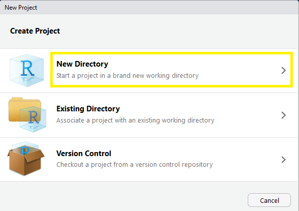
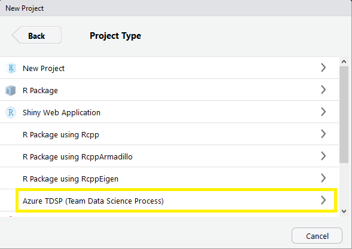

Installation
------------

Install the package using the `install-github.me` service:

    source("https://install-github.me/andrie/TDSP")

Or using `devtools`:

    devtools::install_github("andrie/TDSP")

Usage
-----

The package makes it easy to copy the TDSP folder structure to a new
project. In particular, you can can use the [RStudio Project Templates
feature](https://rstudio.github.io/rstudio-extensions/rstudio_project_templates.html#overview)
to easily create a new RStudio project that contains the TDSP folders:

Select the "New Project..." option in the RStudio file menu:

If the `TDSP` package is installed, you will see an option for
`Azure Team Data Science Process (TDSP)`

License
-------

MIT © Andrie de Vries
